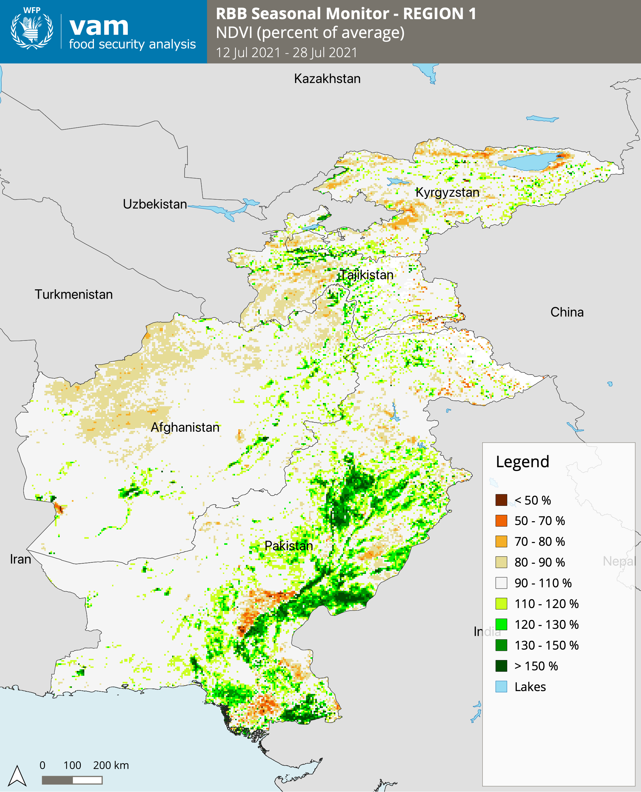
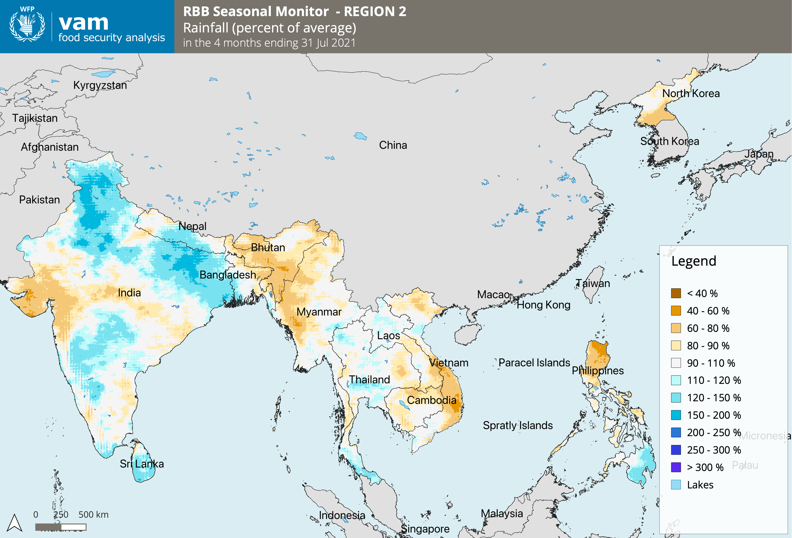
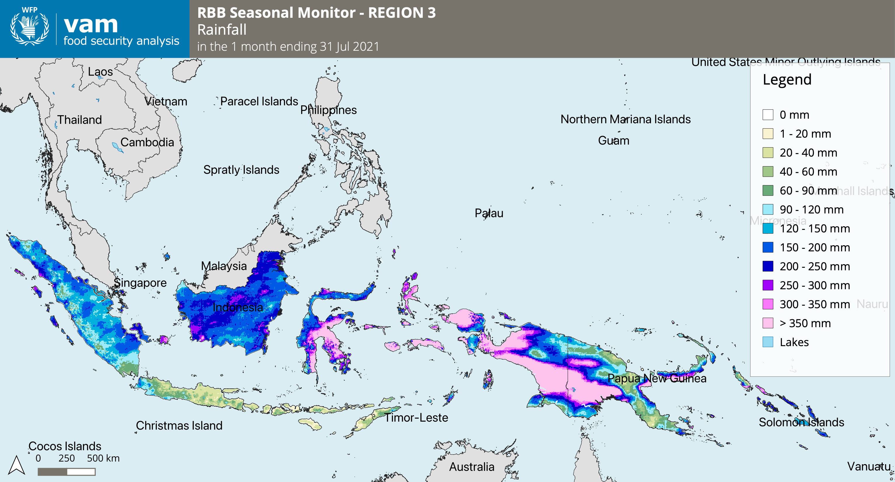

# QGIS automap for Seasonal Monitor

This is a fork repository from https://github.com/wfpidn/automap_RBB which originally I wrote it during my service with WFP, and since I left the agency this guideline no longer maintained. So I will continue to update this at my personal Github repo.

Modified QGIS automap from VAM HQ and adjusted for RBB Seasonal Monitor products. As RBB countries are spanning from South Asia to the Pacific, we divided the countries into 3 region/window analysis.

Below is the list

- **Region 1**: TJK, KGZ, AFG and PAK<br>
- **Region 2**: IND, BTN, NPL, BGD, LKA, MMR, THA, KHM, LAO, VNM, PHL and DPRK<br>
- **Region 3**: IDN, TLS, PNG and SLB

## Setting up environment

The code for the automap is written in Python 3. It is recommended to use either the **Miniconda3** (minimal Anaconda) or **Anaconda3** distribution. The below instructions will be Anaconda specific (although relevant to any Python virtual environment), and assume the use of a bash shell.

### Requirements

1. Download and install [Anaconda Python](https://www.anaconda.com/products/individual) on your machine for [macOS](https://repo.anaconda.com/archive/Anaconda3-2021.05-MacOSX-x86_64.pkg) or [Linux](https://repo.anaconda.com/archive/Anaconda3-2021.05-Linux-x86_64.sh) or [Windows](https://repo.anaconda.com/archive/Anaconda3-2021.05-Windows-x86_64.exe).

	* Follow Installing Anaconda on [macOS](https://docs.anaconda.com/anaconda/install/mac-os/) guideline and for [Linux](https://docs.anaconda.com/anaconda/install/linux/) and [Windows](https://docs.anaconda.com/anaconda/install/windows/)

> Or you can use [Miniconda](https://docs.conda.io/en/latest/miniconda.html) for [macOS](https://repo.anaconda.com/miniconda/Miniconda3-latest-MacOSX-x86_64.pkg) or [Linux](https://repo.anaconda.com/miniconda/Miniconda3-latest-Linux-x86_64.sh) and [Windows](https://repo.anaconda.com/miniconda/Miniconda3-latest-Windows-x86_64.exe). And follow the installation guideline for [macOS](https://conda.io/projects/conda/en/latest/user-guide/install/macos.html), [Linux](https://conda.io/projects/conda/en/latest/user-guide/install/linux.html) and [Windows](https://conda.io/projects/conda/en/latest/user-guide/install/windows.html)

2. Download and install [QGIS](https://qgis.org/en/site/index.html) Long Term Release 3.16.8 on your machine for [macOS](https://qgis.org/downloads/macos/ltr/qgis_ltr_final-3_16_8_20210619_044746.dmg) or [Linux](https://qgis.org/en/site/forusers/alldownloads.html#linux) or [Windows](https://qgis.org/downloads/QGIS-OSGeo4W-3.16.8-4.msi).

3. Download **automap_RBB** folder and it's content via this link: https://github.com/wfpidn/automap_RBB/archive/refs/heads/main.zip. The folder consist of:

``` bash
├── csv				# List of product, code for ach product and color ramp.
├── maps			# Default output folder for maps
├── products			# Default input folder with GeoTIFF files
├── scripts			# Python scripts
│   ├── __pycache__
│   │   ├── **/*.pyc
│   ├── function.py
│   ├── preProduce.py
│   ├── produce.py
├── templates			# Layers, logo, layer styles and qgz templates
│   ├── _layer_styles		# Symbology in `*.qml` format
│   │   ├── **/*.qml
│   ├── _layers 		# World shapefile from GADM, Marine Regions, Global Lake
│   │   ├── **/*.shp
│   │   ├── **/*.dbf
│   │   ├── **/*.shx
│   │   ├── **/*.prj
│   ├── _logos			# VAM food security logo in various format
│   │   ├── **/*.svg
│   │   ├── **/*.png
│   │   ├── **/*.jpg
│   ├── _qgz			# QGIS project files for all the region
│   │   ├── **/*.qgz
├── automap.py 			# Main python script to execute (to produce png maps)
├── automapQGIS.yml		# yml file for creating the environment
├── README.md 			# Readme file
```

4. Extract it into your working directory, you will have `automap_RBB` folder.
5. Download geospatial data from this link: https://www.dropbox.com/s/ptfdp1p9ltrvwwa/_layers.zip?dl=0
6. Extract above `zip` file and move the contents to `automap_RBB/templates/_layers`

### Configure the python environment

A new Anaconda [environment](https://conda.io/docs/using/envs.html) can be created using the [conda](https://conda.io/docs/) environment management system that comes packaged with Anaconda. 

> This step must **only be done the first time**. Once the environment has been created there is no need to do it again.

1. Navigate to `automap_RBB` folder in your Terminal or Command-Prompt
2. Create the environment from the `automapQGIS.yml` file.

	Type `conda env create -f automapQGIS.yml` then execute.

3. Activate the environment by typing `conda activate automapQGIS` then execute.

The environment now has been activated. The python scripts must be run inside this environment in order to work.

## Producing maps

You need to get latest seasonal monitoring geospatial data from VAM HQ, contact Giancarlo Pini to get the data. Usually the latest data in IDRISI format (`*.rst`) are uploaded in this folder, link: [https://drive.google.com/drive/u/0/folders/1kmpsja6_5BYhj7AtxUPou3e6BIOVZTJk](https://drive.google.com/drive/u/0/folders/1kmpsja6_5BYhj7AtxUPou3e6BIOVZTJk). 

Then you can easily convert it to GeoTIFF using [GDAL](https://gdal.org). If you does not have GDAL in your machine, pelase install it via `conda`.

### Get the data

1. Install GDAL, type in your Terminal or Command-Prompt `conda install -c conda-forge gdal`
2. Download latest `*.rst` files from above link, let assume the result are inside `Downloads` folder (It can be in `~/Downloads` or `C:/Download`) and your file is `drive-download-20210811T141722Z-001.zip`. 
3. Unzip file `drive-download-20210811T141722Z-001.zip`
4. Navigate to folder `drive-download-20210811T141722Z-001`, and create a new folder called `TIF`
5. Convert `*.rst` to `*.tif` by typing below script in your Terminal or Command-Prompt

	``` bash
	for i in `find *.rst`; do gdal_translate -of GTiff -co COMPRESS=LZW -co PREDICTOR=1 $i ./TIF/$i.tif; done
	```

6. Move all the result (`GeoTIFF` files) inside `TIF` folder to `automap_RBB/products`. The files must respect the naming convention.

Alternative way, you can request to VAM HQ all the data in GeoTIFF format, no need to doing conversion as explain in above steps.

### Running the script

In your Terminal or Command-Prompt, navigate to the `automap_RBB` folder.
Run the automap.py script by typing `python automap.py`

By default all `*.tif` files in the products folder will be mapped as `*.png` maps in the `maps` folder. The maps will be stored in 3 different subfolders (`Region1`, `Region2` and `Region3`) for each sub-region. 

## Options

When running the script, 4 additional flags can be added:

``` bash
--select 	# A window with the available product types will appear so that the user can choose which products to map.
		# By default all of the products are mapped

--overwrite	# All the products will be mapped
		# By default, only the products which are not present in the output folder will be mapped

--input		# Select input folder with the .tiff files
		# Default is automap_RBB/products

--output 	# Select output folder for the PNG maps
		# Default is automap_RBB/maps
```

**Example:**

`python automap.py –-select --input` or `python automap.py --overwrite`

The user can **add a new product type**.

1. Update the `product_types.csv` file in `automap_RBB/csv`

	You should add the name of the product type (in capital letters), the title and the name of its color-ramp.

2. Create the associated color ramp (`.qml` file) and add it in `automap_RBB/templates/_layer_styles`

## Example Maps

**Region 1**



**Region 2**




**Region 3**



## Credits

Thanks to Juliette Holland, Sophia Rosa, Irene Ferrari and Giancarlo Pini